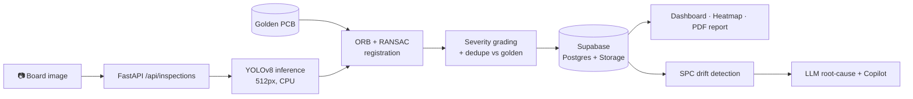

<div align="center">

# 🔬 PCBMind AI

**AI-powered PCB defect inspection: upload a board photo, get annotated defects, severity, and a QA report in seconds.**

<p>
  
  
  
  
  
  
</p>

<p>
  
  
  
</p>

[Features](#-features) · [How it works](#-how-it-works) · [Tech stack](#-tech-stack) · [Quick start](#-quick-start) · [API](#-api-overview) · [Roadmap](#-roadmap)

</div>

---

## 🎯 The problem

Manual visual inspection of printed circuit boards is slow, inconsistent between inspectors, and misses tiny defects such as mouse bites and spurs. Automated optical inspection (AOI) machines solve this, but they are expensive and out of reach for small electronics manufacturers.

**PCBMind AI** brings AOI-style inspection to any camera and a browser. It pairs a YOLOv8 detector trained on public PCB-defect datasets with a *golden board* comparison, statistical process control, and an LLM copilot that answers questions about your real QA data.

## 📸 Demo

<!-- Add a screenshot or GIF here — it is the single biggest driver of stars.
     e.g.  -->

> 🖼️ *Screenshots coming soon.*

## ✨ Features

| | Feature | What it does |
|---|---|---|
| 🧠 | **AI defect detection** | YOLOv8 model detects 6 defect classes: `missing_hole`, `mouse_bite`, `open_circuit`, `short`, `spur`, `spurious_copper` |
| 🟢 | **Golden PCB comparison** | Register a known-good board per template; ORB feature matching + RANSAC aligns it to each capture so baseline artifacts are suppressed |
| 📐 | **Gerber support** | Upload a Gerber design file and it is rendered client-side into a golden reference image |
| 🚦 | **Severity grading** | Every defect is graded `critical` / `major` / `minor` (e.g. shorts and opens are critical) |
| 🔥 | **Defect heatmaps** | Lazily generated heatmaps show where defects cluster on a board |
| 📄 | **PDF & Excel reports** | One-click inspection reports (ReportLab) and data exports (openpyxl) |
| 📈 | **Statistical process control** | Control charts with Nelson / Western-Electric rules catch process drift *before* yield drops |
| 🕵️ | **AI root-cause analysis** | When the line drifts out of control, an LLM names the most probable cause from real signals |
| 💬 | **Manufacturing copilot** | Multi-turn chat with tool-calling over your organization's actual inspection data |
| 🔎 | **Unit traceability** | Track every board by serial number across its inspection history |
| 🔁 | **Feedback loop** | Mark predictions right or wrong; export labelled data for retraining |
| 👥 | **Teams & plans** | Organizations, roles, notifications, and Free / Pro / Enterprise tiers |

## ⚙️ How it works



The inference service is the only part of the code that touches YOLO and OpenCV. Routers, reports, and dashboards call `run_inspection()` and nothing else, so you can swap, retrain, or split out the model without changing the API.

It's also tuned to run on a **512 MB, CPU-only instance**: CPU-only PyTorch wheels, capped thread pools, `MALLOC_ARENA_MAX=1`, and lazy heatmap/report generation kept off the inference hot path.

## 🛠️ Tech stack

| Layer | Technology |
|---|---|
| **Frontend** | Next.js 15 (App Router), React 18, TypeScript, Tailwind CSS, Radix UI / shadcn, Framer Motion, Recharts |
| **Backend** | FastAPI, Pydantic v2, SQLAlchemy 2 (async) + asyncpg |
| **ML / CV** | Ultralytics YOLOv8n, PyTorch (CPU), OpenCV, NumPy |
| **Data** | Supabase (PostgreSQL, Auth, Storage) |
| **LLM** | OpenRouter (Claude models) for summaries, root-cause analysis, and the copilot |
| **Reports** | ReportLab (PDF), openpyxl (Excel) |
| **Infra** | Docker, Render (API) |

## 📁 Project structure

```
pcb-mind/
├── frontend/            # Next.js 15 app — marketing, auth, dashboard
│   ├── app/dashboard/   # upload, inspections, templates, SPC, copilot, traceability, team
│   └── components/      # inspection overlay, stat tiles, copilot chat, UI kit
├── backend/
│   └── app/
│       ├── routers/     # REST endpoints (inspections, templates, spc, copilot, …)
│       ├── services/    # ai_inference, registration, spc, heatmap, report, copilot
│       ├── core/        # config, security, severity, plans
│       └── db/          # SQLAlchemy models
├── ml/                  # dataset builder, training script, demo seeding
└── database/schema.sql  # run once in Supabase
```

## 🚀 Quick start

### Prerequisites
- Python 3.11+, Node.js 18+
- A free [Supabase](https://supabase.com) project
- *(optional)* An [OpenRouter](https://openrouter.ai) key for the copilot and AI summaries

### 1. Database
Open the Supabase **SQL editor** and run `database/schema.sql`. Then create a storage bucket called `pcb-images`.

### 2. Backend
```bash
cd backend
python -m venv .venv && source .venv/bin/activate   # Windows: .venv\Scripts\activate
pip install -r requirements.txt
cp .env.example .env        # fill in Supabase URL/keys, DATABASE_URL, OPENROUTER_API_KEY
uvicorn app.main:app --reload
```
The API runs at `http://localhost:8000`, and interactive docs are at `/docs`.

> 💡 For `DATABASE_URL`, use Supabase's **session pooler** (port 5432). The direct host is IPv6-only, and the transaction pooler conflicts with asyncpg's prepared statements.

### 3. Frontend
```bash
cd frontend
npm install
cp .env.example .env.local  # NEXT_PUBLIC_SUPABASE_URL, NEXT_PUBLIC_SUPABASE_ANON_KEY, NEXT_PUBLIC_API_URL
npm run dev
```
Open `http://localhost:3000`.

### 🐳 Docker (backend)
```bash
cd backend
docker build -t pcbmind-api .
docker run -p 8000:8000 --env-file .env pcbmind-api
```

## 🧪 Training the model

```bash
pip install -r ml/requirements-train.txt
python ml/build_combined_dataset.py                 # merge Roboflow + PKU-Market-PCB + DeepPCB
python ml/train.py --epochs 12 --imgsz 512 --batch 16
```
The trained weights are copied to `backend/app/services/weights/pcb_defect_yolo.pt` automatically. You'll need a free Roboflow API key (`ROBOFLOW_API_KEY`).

## 🔌 API overview

| Method | Endpoint | Description |
|---|---|---|
| `POST` | `/api/inspections` | Upload an image and run AI inspection |
| `GET` | `/api/inspections/{id}` | Inspection with predictions |
| `GET` | `/api/inspections/{id}/report` | PDF report |
| `GET` | `/api/inspections/{id}/heatmap` | Defect heatmap |
| `PATCH` | `/api/inspections/{id}/predictions/{pid}/feedback` | Mark a prediction correct or incorrect |
| `POST` | `/api/pcb-templates/{id}/golden` | Register a golden reference board |
| `GET` | `/api/spc` · `/api/spc/root-cause` | Control chart, drift signals, and AI root cause |
| `POST` | `/api/copilot/chat` | Ask the manufacturing copilot |
| `GET` | `/api/units/{serial}` | Unit traceability |
| `GET` | `/api/dashboard` · `/api/analytics` | KPIs and trends |

The full interactive reference is at `/docs` (Swagger UI).

## 🗺️ Roadmap

- [x] YOLOv8 defect detection with severity grading
- [x] Golden-board registration and Gerber import
- [x] SPC drift detection + AI root-cause analysis
- [x] Tool-calling manufacturing copilot
- [ ] Larger, factory-specific training data and model evaluation dashboard
- [ ] Live camera / conveyor capture mode
- [ ] Billing integration for paid plans

## 🤝 Contributing

Contributions are welcome! Fork the repo, create a branch (`git checkout -b feature/amazing`), and open a pull request.

## 👤 Author

**Aditya Ayushman Sahoo**: B.Tech CSE (AI/ML), SRM Institute of Science and Technology

[](https://linkedin.com/in/aditya-ayushman-sahoo-243b81287)
[](https://github.com/adityaayushman)

---

<div align="center">

⭐ **If PCBMind AI is useful or interesting to you, please star the repo. It helps a lot!** ⭐

</div>
